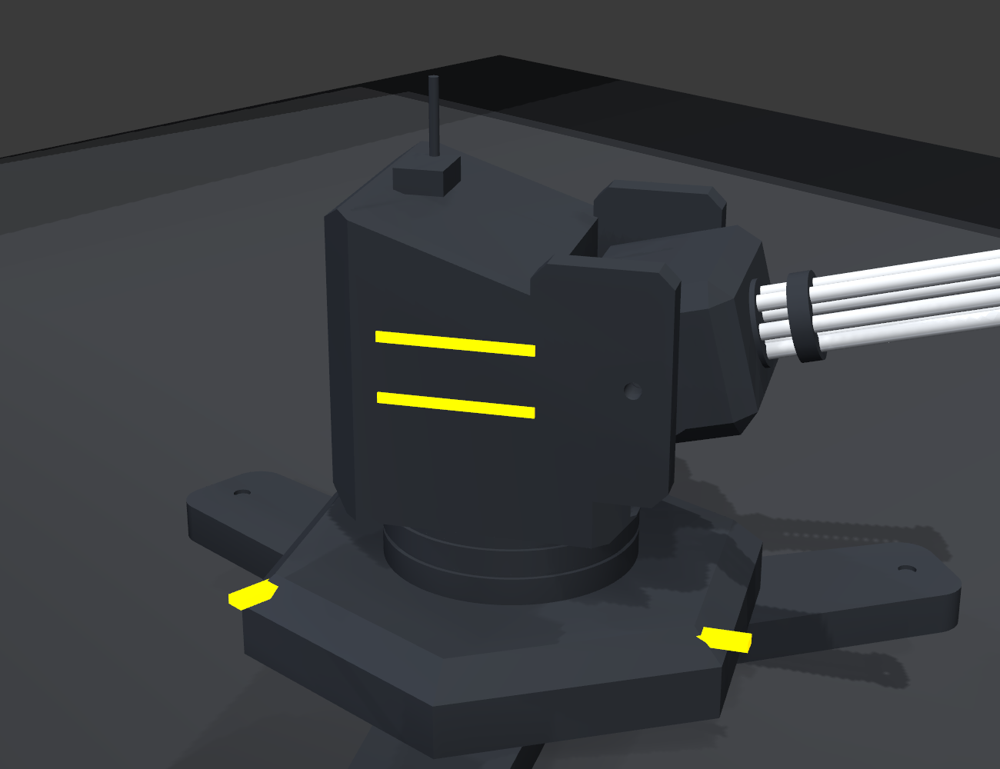

# Torreta Gatling — modelo CAD paramétrico y articulado

Modelo CAD paramétrico (build123d, sólidos B-rep sobre OpenCASCADE) de una torreta
gatling sci-fi, **inspirada** en la referencia de `../ejemplos_diseño/`, para el TFI
*Torreta-Escáner 3D* (UTN FRSR 2026). Es una obra paramétrica **original** (código que
evoca el diseño), no una copia de mallas de terceros.

**Articulada y ensamblable:** se imprime en 3 piezas separadas que se unen con
pasadores/tornillos y luego **se mueven de verdad**:
- **pan**  — el cuerpo gira sobre el eje vertical dentro de la base.
- **tilt** — la cuna + cañón bascula sobre el muñón (apunta arriba/abajo).



## Instalación

```bash
cd diseño
uv venv .venv && source .venv/bin/activate
uv pip install -e .
```

## Uso

```bash
python -m torreta.cli build      # valida cada pieza + exporta STL/STEP + GLB + renders
python -m torreta.cli render      # render posado (hero); --grid para 2x2
python -m torreta.cli exploded    # vista explotada (despiece)
python -m torreta.cli check       # gate de imprimibilidad por pieza
python -m torreta.cli motion      # tira del rango de movimiento (pan/tilt)
python -m torreta.cli --yaml otro.yaml render   # variante de parámetros
```

## Piezas y articulación

| Pieza | Mueve | Junta |
|---|---|---|
| `base` | estática | socket central de pan + paso de tornillo M3 |
| `body` | **pan** (gira en la base) | eje inferior que entra en el socket, retenido por un tornillo M3 desde abajo |
| `gun` (cuna + cañón) | **pan + tilt** | pasador/tornillo M3 a través de las orejas del muñón |

Cada pieza se exporta a `outputs/parts/<pieza>.stl` y `.step`, en orientación neutra.
La holgura entre piezas móviles se controla con `global.clearance_mm` (0.35 mm por
defecto). El GLB (`outputs/torreta.glb`) es el ensamble posado con colores, para verlo
en 3D (gltf-viewer web, Blender, Windows 3D Viewer).

## Ensamblado físico (orientativo)

1. Imprimir `base`, `body`, `gun`.
2. Insertar el eje de `body` en el socket de `base`; fijar con un **M3 desde abajo**
   (no apretar a fondo → gira libre = pan).
3. Colocar `gun` entre las orejas de `body`; pasar un **M3 (o pasador impreso)** por
   los orificios del muñón → bascula = tilt.

> Más adelante, esas mismas juntas alojan los **actuadores reales del TFI**: el
> stepper 28BYJ-48 para el pan (en el socket) y un servo SG90 para el tilt (en el muñón).

## Parámetros (`turret.yaml`)

Todo sale del YAML, sin números mágicos. Secciones: `global` (escala, holgura, pared
mínima), `base` (hexágono, patas/trípode, tread, socket de pan), `neck` (tambor + eje),
`body` (cuña facetada, franjas, caja de munición, ventana, muñón), `cradle` (cuna),
`barrels` (**cañones: cantidad, diámetro, largo, abrazaderas**), `pose`
(`pan_deg`/`tilt_deg`/`spin_deg`), `style` (colores del render).

## Arquitectura del código

```
turret.yaml          fuente de verdad
torreta/
  config.py          carga + valida el YAML (con defaults; invariantes y holguras)
  geom.py            prismas regulares y helpers
  layout.py          alturas del apilado + eje de elevación (para que las piezas encajen)
  parts/
    base.py          hexágono + patas trípode con tread + chevrones + socket de pan
    body.py          cuña facetada + cuello/eje + orejas de muñón + franjas + caja
    cradle.py        cuna/yugo que bascula
    barrels.py       cañones finos y largos + abrazaderas
  assembly.py        compone la pose (render) y fusiona cada pieza (export)
  validate.py        gate de imprimibilidad POR PIEZA (1 sólido, estanco, válido)
  export.py          STL/STEP por pieza + GLB del ensamble
  render.py          render offscreen de estudio (PyVista): hero, grilla, explotada
  cli.py             build | render | exploded | check | motion
```

## Estado

**Hecho:** réplica fiel articulada (pan + tilt), 3 piezas imprimibles validadas, juntas
con tornillos M3, render de estudio, export STL/STEP/GLB.

**Próximo:** afinar fidelidad fina (chevrones, panel lines grabadas, boca del cañón),
alojamientos para el stepper/servos reales, y detalle de la caja de munición/ventana.
