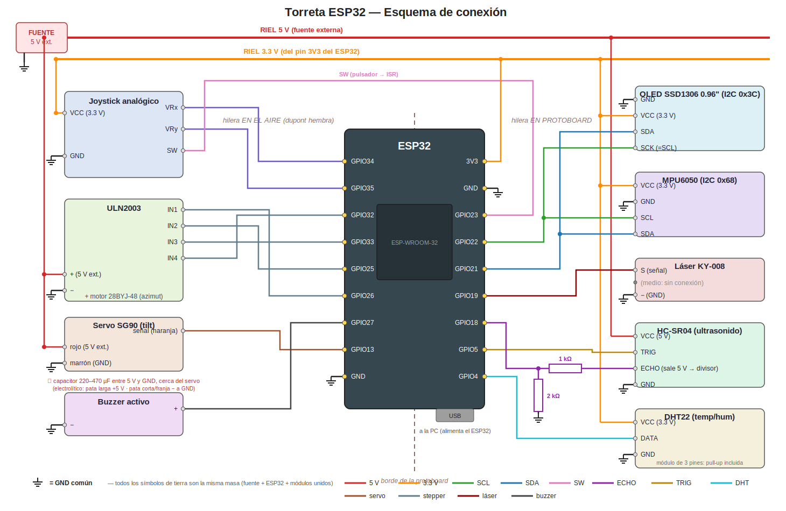

# Armado del circuito — paso a paso

Guía de conexionado de la torreta sobre protoboard. El mapa de pines de este documento es la
**fuente única de verdad**: el firmware debe usar exactamente estos números de GPIO.

> **Placa:** ESP32 con módulo ESP-WROOM-32 (FCC ID 2AC7Z-ESPWROOM32).
> **Montaje elegido:** la placa es más ancha que la protoboard, así que se monta **al borde**,
> con una hilera de pines pinchada en la protoboard y la otra **en el aire**, cableada con
> dupont hembra directo a los módulos (ver Paso 2).

---

## Reglas de oro (leer antes de tocar nada)

1. **Todo se cablea con la alimentación desconectada.** Se conecta todo, se revisa, y recién al
   final se energiza (Paso 11).
2. **El ESP32 trabaja a 3.3V.** Sus pines NO toleran 5V directos — por eso el divisor resistivo
   en el ECHO del HC-SR04.
3. **El servo y el stepper NO se alimentan desde el ESP32.** Van a la fuente externa de 5V; el
   USB de la PC alimenta solo al ESP32. Si los motores tiran del pin 5V de la placa, el ESP32
   se resetea solo.
4. **Todas las masas (GND) van unidas:** fuente externa, ESP32 y todos los módulos comparten
   GND. Es el error #1 de los circuitos que "funcionan a veces".

---

## Mapa de pines

| Componente | Pin del módulo | Pin ESP32 | Hilera | Alimentación |
|---|---|---|---|---|
| LCD 1602 I2C | SDA / SCL | GPIO21 / GPIO22 | protoboard | 5V |
| MPU6050 (GY-521) | SDA / SCL | GPIO21 / GPIO22 (mismo bus) | protoboard | 3.3V |
| HC-SR04 | TRIG | GPIO5 | protoboard | 5V |
| HC-SR04 | ECHO | GPIO18 **(vía divisor 1kΩ/2kΩ)** | protoboard | — |
| DHT22 | DATA | GPIO4 | protoboard | 3.3V |
| Joystick | VRx / VRy | GPIO34 / GPIO35 (solo-entrada, ADC1) | aire | 3.3V |
| Joystick | SW (pulsador / ISR) | GPIO23 | protoboard | — |
| Servo SG90 | Señal (cable naranja) | GPIO13 | aire | **5V externa** |
| ULN2003 | IN1 / IN2 / IN3 / IN4 | GPIO26 / GPIO25 / GPIO33 / GPIO32 | aire | **5V externa** |
| Láser (KY-008) | S | GPIO19 | protoboard | — |
| Buzzer activo | + | GPIO27 | aire | — |

**Pines prohibidos** (no usar aunque estén libres): GPIO0, 2, 12 y 15 son de *strapping* —
interfieren con el arranque de la placa— y GPIO6–11 van a la flash interna.

**Hileras:** la hilera con **3V3, GPIO21, 22, 23, 19, 18, 5, 4 y GND** es la que se pincha en
la protoboard (concentra el bus I2C, los sensores y el divisor del ECHO, que es el único
circuito que se arma sobre la placa). La hilera con **GPIO34, 35, 32, 33, 25, 26, 27, 13, GND
y VIN** queda en el aire: todas sus señales terminan en conectores de módulos (joystick, servo,
ULN2003, buzzer), así que van con **dupont hembra** directo del pin al módulo.

---

## Gráfico de conexión



Código de colores: **rojo** 5 V (fuente externa) · **naranja** 3.3 V · **negro** GND ·
**verde/azul** I2C (SCL/SDA) · el resto son señales individuales, etiquetadas en cada extremo.
El borde punteado marrón marca el borde de la protoboard: la hilera izquierda del ESP32 queda
en el aire y se cablea con dupont hembra directo a cada módulo.

### Versión ASCII (para ver en terminal)

```
      HILERA EN EL AIRE                              HILERA EN PROTOBOARD
      (dupont hembra al módulo)                      (pinchada en la placa)

                     ┌──────────────────────────────────────┐
                     │         ESP32 (ESP-WROOM-32)         │
                     │            USB ──► a la PC           │
                     │                                      │
    Joystick VRx ────┤ GPIO34                           3V3 ├──── riel 3.3V
    Joystick VRy ────┤ GPIO35                           GND ├──── riel GND (azul)
     ULN2003 IN4 ────┤ GPIO32                        GPIO23 ├──── SW joystick (ISR)
     ULN2003 IN3 ────┤ GPIO33                        GPIO22 ├──── SCL → LCD + MPU6050
     ULN2003 IN2 ────┤ GPIO25                        GPIO21 ├──── SDA → LCD + MPU6050
     ULN2003 IN1 ────┤ GPIO26                        GPIO19 ├──── S láser KY-008
      Buzzer (+) ────┤ GPIO27                        GPIO18 ├◄─── divisor 1kΩ/2kΩ ◄── ECHO HC-SR04
 Servo (naranja) ────┤ GPIO13                         GPIO5 ├──── TRIG HC-SR04
 riel GND (azul) ────┤ GND                            GPIO4 ├──── DATA DHT22
                     │ VIN (sin usar)                       │
                     └──────────────────────────────────────┘
```

### Distribución de alimentación

```
FUENTE EXTERNA 5V ──► riel 5V ──┬── VCC LCD 1602
                                ├── VCC HC-SR04
                                ├── rojo servo SG90 (+ capacitor 220–470 µF a GND)
                                └── (+) ULN2003

ESP32 3V3 ────────► riel 3.3V ──┬── VCC MPU6050
                                ├── VCC DHT22
                                └── VCC joystick

GND COMÚN: fuente externa + ESP32 + todos los módulos
           (los dos rieles azules de la protoboard, puenteados entre sí)
```

El detalle del divisor del ECHO está dibujado en el Paso 4.

---

## Paso a paso

### Paso 1 — Rieles de la protoboard

- Riel rojo superior = **5V de la fuente externa**.
- Riel rojo inferior = **3.3V del ESP32**.
- Ambos rieles azules = **GND común**: puentear los dos rieles azules entre sí, y conectar ahí
  el GND de la fuente externa y un GND del ESP32.
- Marcar con cinta cuál riel es 5V y cuál 3.3V — **cruzar eso quema el MPU6050**.

### Paso 2 — ESP32 al borde de la protoboard

Montar la placa en el extremo de la protoboard de modo que la hilera de **3V3 / 21 / 22 / 23 /
19 / 18 / 5 / 4 / GND** quede pinchada en la placa, y la otra hilera (34 / 35 / 32 / 33 / 25 /
26 / 27 / 13) **cuelgue fuera del borde, en el aire**. El USB debe quedar accesible para el
cable a la PC.

- A la hilera colgante se llega con **dupont hembra** (hembra al pin del ESP32, el otro extremo
  según el módulo de destino).
- Conectar el pin **GND** de la hilera pinchada al riel azul y el pin **3V3** al riel de 3.3V.
- Sugerencia mecánica: una gota de silicona caliente o una brida entre placa y protoboard evita
  que el conjunto haga palanca cuando la torreta vibre. **Todavía no enchufar el USB.**

### Paso 3 — Bus I2C (LCD + MPU6050)

Los dos comparten el bus: **SDA de ambos a GPIO21, SCL de ambos a GPIO22**.

- LCD 1602: VCC a 5V, GND a masa.
- MPU6050: VCC a **3.3V**, GND a masa.

Tienen direcciones distintas (LCD `0x27` o `0x3F`, MPU `0x68`), así que conviven sin conflicto.

> Nota: el backpack del LCD tiene pull-ups a 5V; en la práctica funciona directo con el ESP32
> de forma confiable, pero si hay un level shifter bidireccional disponible, este es el lugar
> para usarlo.

### Paso 4 — HC-SR04 (con divisor en el ECHO)

- VCC a 5V, GND a masa, TRIG directo a GPIO5.
- El ECHO sale a 5V: armar el divisor en la protoboard:
  **ECHO → 1kΩ → nodo → GPIO18**, y del mismo nodo **2kΩ → GND**. Eso deja ~3.3V en el pin.
  (Sirve cualquier par con relación 1:2, p. ej. 10k/20k.)

```
ECHO ──[ 1kΩ ]──┬── GPIO18
                │
              [ 2kΩ ]
                │
               GND
```

### Paso 5 — DHT22

- VCC a 3.3V, GND a masa, DATA a GPIO4.
- Módulo de 3 pines: ya trae la pull-up, conectar directo.
- Sensor pelado de 4 patas: pata 1 VCC, pata 2 DATA, pata 4 GND (la 3 no se usa), y agregar
  **10kΩ entre DATA y VCC**.

### Paso 6 — Joystick

- VCC a **3.3V** (importante: así el ADC lee el rango completo; a 5V satura y puede dañar el pin).
- GND a masa, VRx a GPIO34, VRy a GPIO35 (dupont hembra a la hilera colgante), SW a GPIO23.
- El SW no necesita resistencia: se activa la pull-up interna por firmware y la ISR dispara por
  flanco de bajada.

### Paso 7 — Servo SG90 (elevación)

- Marrón a GND, **rojo al riel de 5V externo** (no al ESP32), naranja a GPIO13 (dupont hembra).
- Si hay un capacitor electrolítico (220–470µF), ponerlo entre 5V y GND cerca del servo,
  respetando polaridad: absorbe los picos de arranque.

### Paso 8 — Stepper 28BYJ-48 + ULN2003 (azimut)

- El motor se enchufa al conector blanco de la placa ULN2003 (entra de una sola forma).
- En la placa: `+` al riel de **5V externo**, `−` a masa.
- IN1→GPIO26, IN2→GPIO25, IN3→GPIO33, IN4→GPIO32 (dupont hembra a la hilera colgante).
- **Respetar ese orden**: si la secuencia queda cruzada, el motor vibra en lugar de girar.

### Paso 9 — Láser y buzzer

- Láser KY-008: S a GPIO19, `−` a masa (el pin del medio no se usa).
- Buzzer activo: `+` a GPIO27 (dupont hembra), `−` a masa.
- Ambos consumen poco y van directo del GPIO; si el láser se ve débil, pasarlo a 5V con un
  transistor NPN como llave.

### Paso 10 — Inspección antes de energizar

Con todo desconectado, revisar módulo por módulo:

- [ ] Ningún VCC de 5V tocando el riel de 3.3V (en especial MPU6050 y joystick).
- [ ] GND de la fuente externa unido al GND del ESP32 (rieles azules puenteados).
- [ ] Divisor del ECHO presente (GPIO18 nunca recibe 5V directos).
- [ ] Rojo del servo y `+` del ULN2003 en el riel **externo**, no en el ESP32.
- [ ] Dupont hembra de la hilera colgante firmes (tirar suave de cada uno).

### Paso 11 — Encendido por etapas y verificación

1. Enchufar **solo el USB** (sin fuente externa). El LED del ESP32 enciende y nada calienta.
   Tocar con el dedo el MPU y el LCD: tibio está bien; quemante es polaridad invertida —
   desconectar ya.
2. Cargar un sketch **I2C scanner**: debe reportar dos direcciones (`0x27`/`0x3F` y `0x68`).
   Eso valida LCD y MPU6050 de una vez.
3. Probar sensores por monitor serie: distancia del HC-SR04 (acercar la mano), temperatura del
   DHT22, valores X/Y del joystick (centro ≈ 2048) y el pulsador.
4. Recién ahora conectar la **fuente externa de 5V** y probar actuadores de a uno: servo
   barriendo 0–90°, stepper girando una vuelta, láser y buzzer con un blink.

Cuando cada etapa pasa su prueba, el hardware queda validado y lo que sigue es el firmware de
la FSM.

---

*Documento de conexionado. Complementa a `DESCRIPCION_PROYECTO.md` (arquitectura y casos de uso).
El circuito puede probarse virtualmente antes de armarlo: ver `wokwi/README.md`.*
